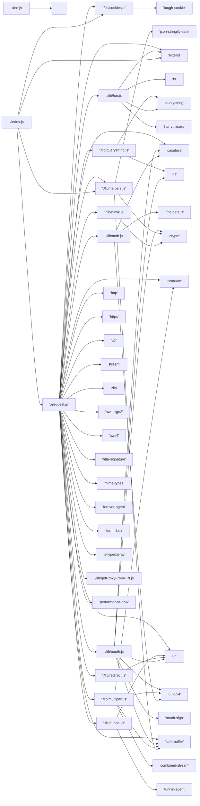

# mermaid, diagrams as code

[mermaid.js](https://mermaid-js.github.io/)

Mermaid is a great tool for creating quick diagrams with text.
It has been getting features and in recent months has improved greatly.
There is also a great [VScode extension](https://marketplace.visualstudio.com/items?itemName=bierner.markdown-mermaid) for rendering mermaid into markdown.

I use this tool to generate simple diagrams, often starting from simple bash commands on lists of files. Here we'll explore a way to create a diagram of your code, and represent it as a mermaid script. diagrams as code, it's a coincidence (albeit a useful use case) our diagram is also of our code.

```sh
grep 'require(' **/*.js
```

When done on the `request` npm module, we get something like this:

```sh

$ npm install request
$ cd node_modules/request
$ grep 'require(' **/*.js
index.js:var extend = require('extend')
index.js:var cookies = require('./lib/cookies')
index.js:var helpers = require('./lib/helpers')
index.js:request.Request = require('./request')
lib/auth.js:var caseless = require('caseless')
lib/auth.js:var uuid = require('uuid/v4')
lib/auth.js:var helpers = require('./helpers')
lib/cookies.js:var tough = require('tough-cookie')
lib/har.js:var fs = require('fs')
lib/har.js:var qs = require('querystring')

                   ...

request.js:var Querystring = require('./lib/querystring').Querystring
request.js:var Har = require('./lib/har').Har
request.js:var Auth = require('./lib/auth').Auth
request.js:var OAuth = require('./lib/oauth').OAuth
request.js:var hawk = require('./lib/hawk')
request.js:var Multipart = require('./lib/multipart').Multipart
request.js:var Redirect = require('./lib/redirect').Redirect
request.js:var Tunnel = require('./lib/tunnel').Tunnel
request.js:var now = require('performance-now')
request.js:var Buffer = require('safe-buffer').Buffer
$
```

This is a list of all of requests dependencies, inner and outer.
It is a tightly scoped and well organized module.
Internal dependencies are mainly used by request.js and index.js, the graph of dependencies is fairly flat.

If we examine the lines, we can see that `request.js`, for example, has a depency on `./lib/oauth`.

```sh
request.js:var OAuth = require('./lib/oauth').OAuth
```

What we want is to translate these lines into mermaid.js graph syntax.

```
request.js --> './lib/oauth'
```

`:var OAuth = require(` becomes ` --> ` and the remainder of the string is truncated.
Everything between the colon and the word 'require' is fairly arbitrary.

The following script can make this transformation.
This can be useful for diving into a new project and getting a quick overview of the structure, or communicating it to other developers.
There may be a surefire way to parse this information from the code, but its worth the time it takes to write a script to handle this kind of thing, as it can be placed in an integration step and documentation can be updated when the code is.

In fact, this snippet might be useful to you right now to get started translating your javascript modules into architectural diagrams.

```javascript
/*
* this script takes the output of : grep 'require(' and turns it into a
* mermaid dependency graph for the request module  
* this will not work on all npm modules, but it might be close enough to cover
* your use case with low effort...
*/

const buffer = [];
process.stdin.on('data', (data) => {
  buffer.push(data.toString('utf8'));
})

process.stdin.on('end', () => {
  buffer.join('')
    .split('\n')
    .map(line => {
      const top = line.split(':')
      const current = top[0];
      if(!top[1]) process.exit(0);
      const slicePoint = top[1].indexOf('require(') + 8;
      let dep = top[1].slice(slicePoint).split(')')[0];

      if(dep.indexOf('./') === 1)
        dep = dep.slice(0,dep.length-1) + ".js'"

      process.stdout.write(`'./${current}' --> ${dep}\n`);
    })
})
```

Save the above code as `translate.js`.

```sh
grep 'require(' **/*.js | node translate.js
```

Running the line above yields this output, which can be copied into VScode and previewed:



Mermaid diagrams can also be templated, and common code structures
can be easily mapped to mermaid diagrams.

Consider the following exxample:

```
graph LR
  module1 --> module2
  module2 --> module4
  module3 --> module4
```

We could template one of these modules if it is variable, such as a database:

```
graph LR
  module1 --> module2
  module2 --> {{database}}
  module3 --> {{database}}
```

This affords us a visual representation of your replacable modules, and the module structure itself. That can be quickly used in a documentation repository.

We could map out an entire service with mermaid, easily updating the visual documentation when a part is swapped out:

```
graph LR
  {{gw}} --> {{api}}
  {{api}} --> {{database}}
  {{nginx}} --> {{static_files}}
  {{nginx}} --> {{auth_backend}}
  {{auth_backend}} --> {{mgmt_db}}
  {{ingress_controller}} --> {{gw}}
```

An example FAST template that might represent a common pattern in an infrastructure:

```yaml
parameters:
  gw: nginx
  api: PaymentsAPI
  static_files: ShoppingCartWebClient
  auth_backend: OAuth
  ingress_controller: BigIpVE
  mgmt_db: MongoDB
template: |
  graph LR
    {{gw}} --> {{api}}
    {{api}} --> {{database}}
    {{gw}} --> {{static_files}}
    {{api}} --> {{auth_backend}}
    {{auth_backend}} --> {{mgmt_db}}
    {{ingress_controller}} --> {{gw}}
```
